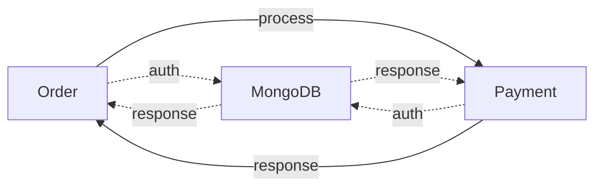

# order-payment-microservices

## Description

- This project contains 2 small services: Order App & Payment App
- 2 Apps are connect with MongoDB service for data store & authentication

## Technical Approach

- Programming language: Typescript

- API Framework: Expressjs

- API standard: Restful API

- Authentication session: JWT

- hash login password: cryptojs

- Database: MongoDB

- ODM: mongoose

- Formatter: Prettier

- Code quality scanner: Eslint

- Pre-commit checker: Husky

- Test tools: mocha, chai, chai-http, nyc

- Test reports: mochawesome, lcov, ts-plato

- API test tool: Postman API

## Preinstallation

- Nodejs: https://nodejs.org/en/download/
- Docker: https://www.docker.com/products/docker-desktop

## Guildlines

1. Install dependencies

- \$ npm i (management & test dependencies)
- \$ cd order-service $$ npm i (dependencies for Order App)
- \$ cd payment-service $$ npm i (dependencies for Payment App)

2. Run apps

- \$ cd [app-source]
- \$ npm run dev (development)
- \$ npm run prod (production)

## APIs

APIs are store in Postman-APIs folder for testing.

1. Order App

- POST: http://localhost:4000/auth/login (login to get JWT & add it to request headers)
- GET: http://localhost:4000/api/order/checkOrderStatus
- POST: http://localhost:4000/api/order/createOrder
- PUT: http://localhost:4000/api/order/cancelOrder

2. Payment App

- POST: http://localhost:5000/api/payment/processOrder

## Tests & analytics

1. unit tests

- \$ npm run test:UT

  => html report will be generated in folder reports/tests

2. integration tests

- start 2 App
- \$ npm run test:IT

  => html report will be generated in folder reports/tests

3. Productivity report

- \$ npm run complex

  => html report will be generated in folder reports/complex

### Deployment

1. Order App

- \$ cd order-service
- \$ docker build . -t [username]/order-service

2. Payment App

- \$ cd payment-service
- \$ docker build . -t [username]/payment-service
